<div align="center">


# PayDoc Extractor

Upload an invoice, boleto, receipt or waybill and get its data back as structured JSON, with a confidence score for every field. A FastAPI service calls Google Gemini on the document, and a React interface shows the result.

**[English](#english) · [Português](#português)**

</div>

<p align="center">
  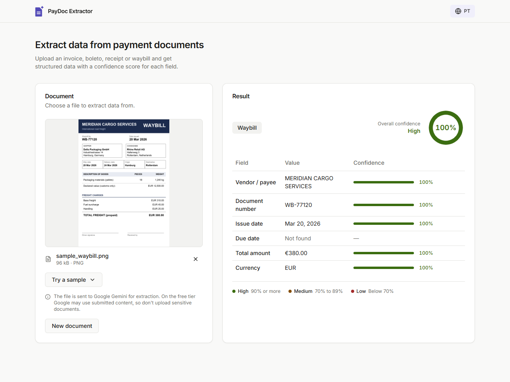
</p>

---

## English

### About

PayDoc Extractor reads payment documents with a multimodal model instead of OCR rules. You send one PDF or image, Gemini classifies it (invoice, boleto, receipt, waybill, or unknown), pulls out six fields (vendor, document number, issue date, due date, total amount, currency), and scores how clearly each one was stated. The API then computes an overall confidence and lists the fields that deserve a human look.

It is a portfolio project meant to show a complete slice of work with generative AI in an application: schema-constrained model output, a prompt written against confidently wrong answers, confidence handled by the application instead of trusted blindly, a typed React client, and a bilingual interface. It was built spec-first, and the requirements, design and task lists are in [`specs/`](specs). Nothing is stored: the file goes to the model and the result goes back to the browser.

### Screenshots

<table>
  <tr>
    <td align="center">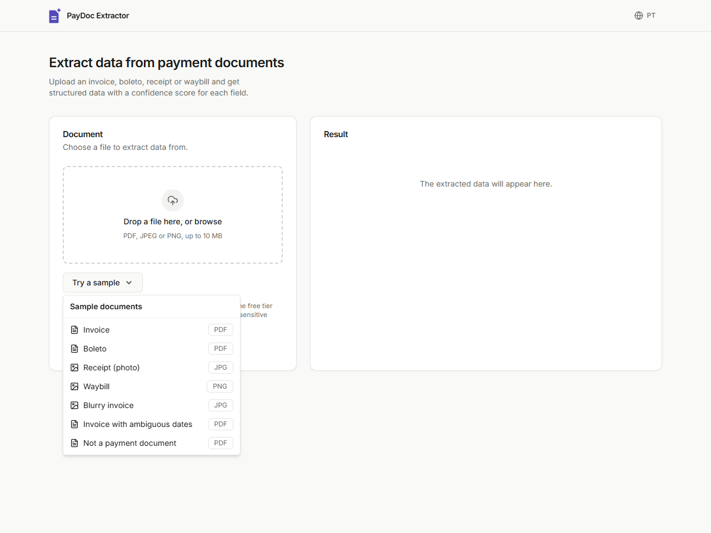<br /><sub>Try a sample: seven bundled synthetic documents</sub></td>
    <td align="center">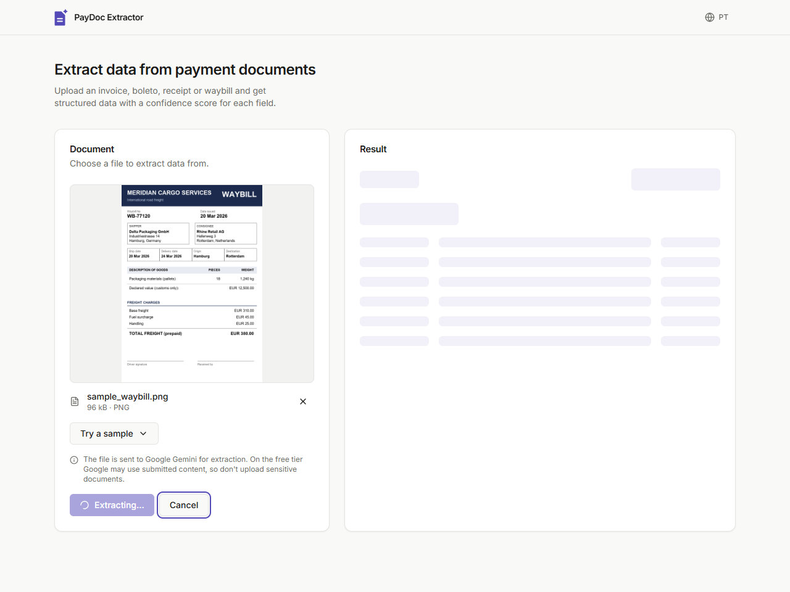<br /><sub>Extraction in progress, with Cancel</sub></td>
  </tr>
  <tr>
    <td align="center">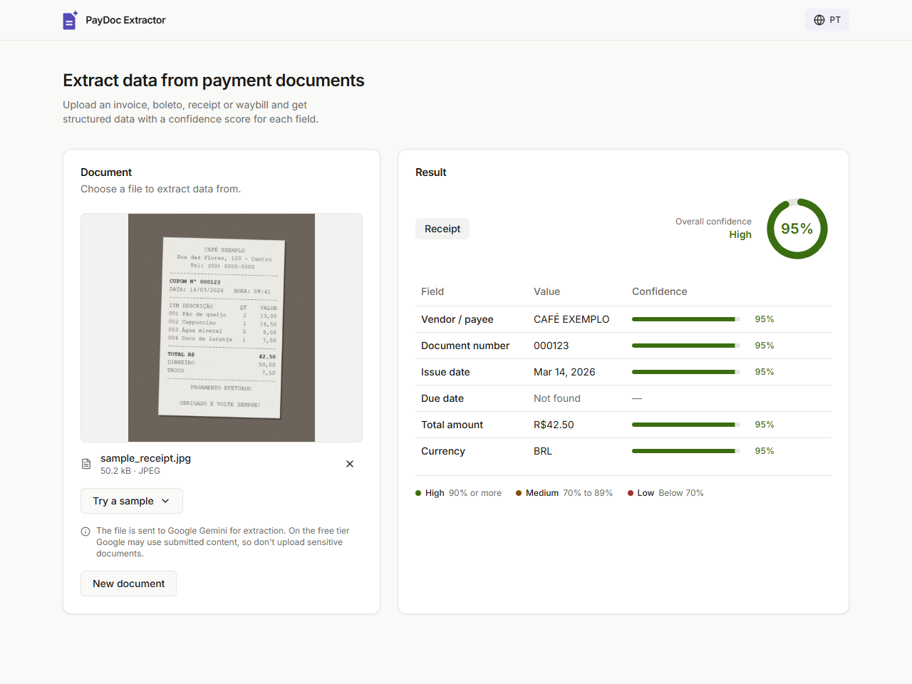<br /><sub>A field the document does not have shows as Not found</sub></td>
    <td align="center">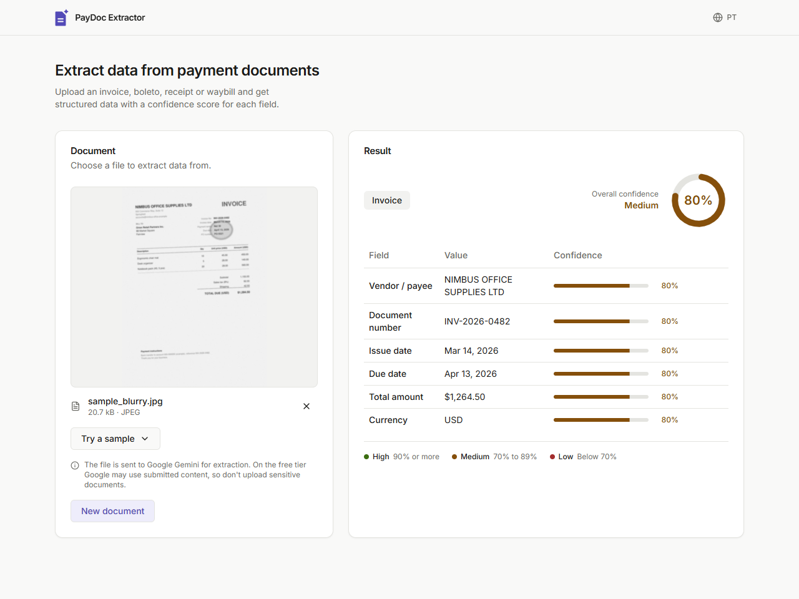<br /><sub>A degraded scan lowers the confidence (the total is misread here, see Limitations)</sub></td>
  </tr>
  <tr>
    <td align="center">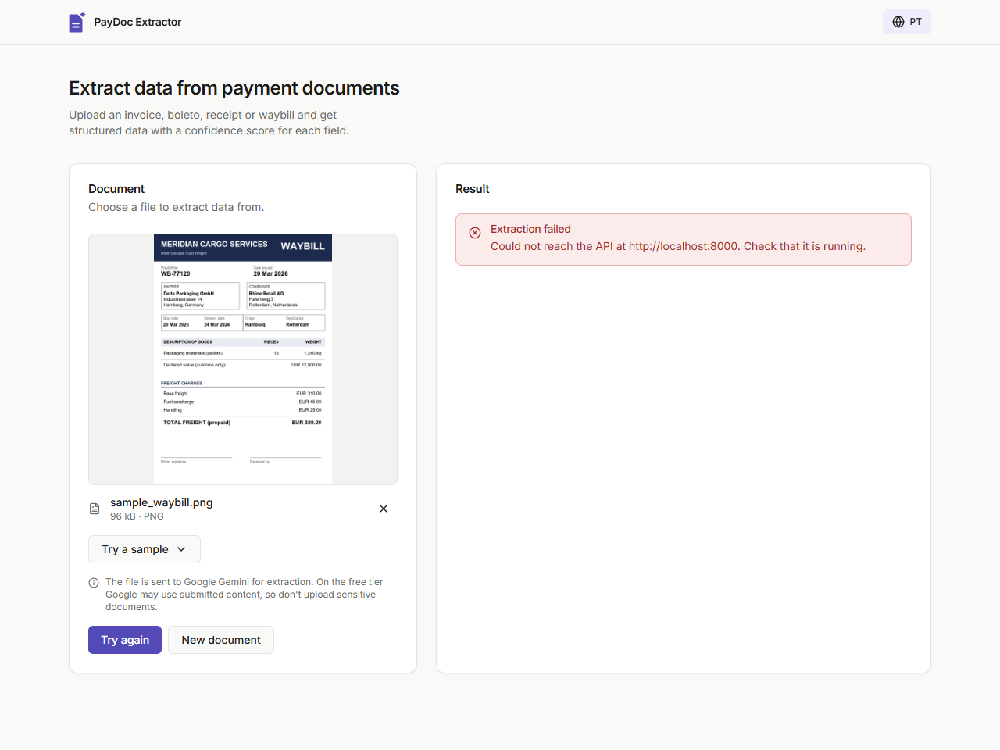<br /><sub>Clear error with retry when the API is unreachable</sub></td>
    <td align="center">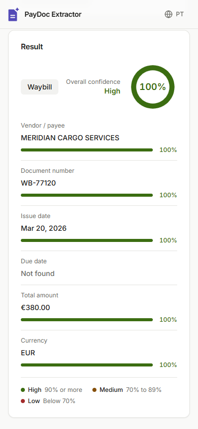<br /><sub>Phone layout</sub></td>
  </tr>
</table>

### Features

- **Document classification**, invoice, boleto, receipt, waybill, or unknown for anything else
- **Six structured fields**, vendor, document number, issue date, due date, total amount and currency, with dates as ISO 8601 and amounts as plain numbers
- **Per-field confidence**, plus an overall score shown as a gauge and a High / Medium / Low level
- **Honest gaps**, a field that is not in the document comes back as `null` and shows as "Not found" instead of a guess
- **Review flags**, fields below a configurable threshold are listed in the response and flagged in the interface
- **Upload or try a sample**, drag and drop a PDF, JPEG or PNG up to 10 MB, or load one of the bundled samples and click Extract
- **Cancel and retry**, an extraction in flight can be cancelled, and a failed one can be retried
- **English / Portuguese UI**, switchable at runtime, with dates and amounts formatted for the chosen language
- **Privacy notice**, always visible, since the file is sent to Google Gemini

### Tech stack

| Layer | Technology |
|---|---|
| API | FastAPI, Pydantic, pydantic-settings, Uvicorn |
| AI | Google Gemini through the `google-genai` SDK (async, structured output) |
| Frontend | React 19, TypeScript, Vite |
| Styling | Tailwind CSS, Radix UI primitives in the shadcn/ui style, `class-variance-authority` |
| Charts | Recharts (the confidence gauge, loaded on demand) |

### How it works

1. The browser posts the file to `POST /extract` as multipart form data.
2. The API checks the type (PDF, JPEG, PNG), that the file is not empty, and the size limit.
3. The bytes go to Gemini as an inline part, together with a system prompt. The response must match the `ExtractionResult` schema.
4. The API validates the reply, then computes `overall_confidence` and `low_confidence_fields` itself.
5. The browser shows the type, the fields, the per-field scores and the review flags.

Example response for the bundled invoice:

```json
{
  "document_type": "invoice",
  "data": {
    "vendor_name": "NIMBUS OFFICE SUPPLIES LTD",
    "document_number": "INV-2026-0482",
    "issue_date": "2026-03-14",
    "due_date": "2026-04-13",
    "total_amount": 1284.5,
    "currency": "USD"
  },
  "confidence": {
    "vendor_name": 1.0,
    "document_number": 1.0,
    "issue_date": 1.0,
    "due_date": 1.0,
    "total_amount": 1.0,
    "currency": 1.0
  },
  "overall_confidence": 1.0,
  "low_confidence_fields": []
}
```

| Endpoint | Description |
|---|---|
| `GET /health` | Returns `{"status": "ok"}` |
| `POST /extract` | Multipart field `file`. Returns the JSON above |

| Status | When |
|---|---|
| `400` | No file was sent, or the file is empty |
| `413` | The file is larger than `MAX_UPLOAD_MB` |
| `415` | The file is not a PDF, JPEG or PNG |
| `502` | The Gemini call failed or returned something unusable |

Interactive API docs are served at `/docs` while the API is running.

### Engineering highlights

A few things worth a closer look in the source:

- **One schema for the model and the API**, the Pydantic model `ExtractionResult` ([`app/schemas.py`](app/schemas.py)) is also Gemini's `response_schema`, so its field descriptions are part of the prompt. The reply is validated again on the server, and anything that does not match becomes a `502` instead of bad data.
- **Confidence is computed by the application**, `overall_confidence` and `low_confidence_fields` come from a small pure function ([`app/extraction_service.py`](app/extraction_service.py)), never from the model. Fields that are `null` are left out, so a missing field neither drags the average down nor gets flagged.
- **A prompt written against confident mistakes**, [`app/prompts.py`](app/prompts.py) tells the model to prefer `null` to a guess, to leave ambiguous dates empty instead of assuming day-first or month-first, to score reading quality, and to cross-check line items against the total. The [synthetic samples](samples) contain decoys (a PO number next to the invoice number, a subtotal above the total, look-alike digits) to test exactly that.
- **Fail-fast configuration**, settings are validated at startup ([`app/config.py`](app/config.py)): a missing API key or a malformed CORS origin stops the process with a message that names the variable.
- **Nothing is persisted**, the upload goes straight to the model as bytes. There is no database or file storage, and the interface keeps only the chosen language in `localStorage`.
- **Typed contract on both sides**, [`frontend/src/types.ts`](frontend/src/types.ts) mirrors the API schemas, and the translations ([`frontend/src/lib/i18n.ts`](frontend/src/lib/i18n.ts)) are typed so a key missing in one language fails `tsc`.
- **A real extraction state machine**, one reducer in [`useExtraction`](frontend/src/hooks/useExtraction.ts) drives idle, ready, extracting, success and error, including cancel through `AbortController`, keyboard focus handling, and `aria-live` announcements.
- **Confidence never relies on color alone**, each level has a name and a legend, and the token colors were checked for WCAG AA contrast.
- **Specs first**, [`specs/`](specs) holds the requirements in EARS form, the design with traceability to them, and the task lists for the API and the interface.

### Project structure

```
app/                       # FastAPI backend
├── main.py                # Routes, input validation, error mapping, CORS
├── config.py              # Settings from the environment, validated at startup
├── schemas.py             # Pydantic models, also Gemini's response schema
├── prompts.py             # System prompt and extraction rules
├── gemini_client.py       # Async Gemini call and error wrapping
└── extraction_service.py  # Orchestration and confidence aggregation
frontend/src/
├── components/            # Upload, preview, result, gauge, table, header
│   └── ui/                # Radix-based primitives (shadcn/ui style)
├── contexts/              # Language provider
├── hooks/                 # useExtraction state machine
├── lib/                   # API client, i18n, formatting, file checks, samples
├── types.ts               # Types mirroring the API schemas
├── App.tsx
└── main.tsx
samples/                   # Synthetic documents with their expected values
specs/                     # Requirements, design and tasks
docs/screenshots/          # Images used in this README
```

### Limitations

- **Privacy on the free tier.** On the Gemini free tier, Google may use submitted content to improve its products. Do not upload real or sensitive documents with a free key. The bundled samples are made up.
- **Confidence is the model's own estimate**, not a calibrated probability. On the bundled blurry invoice, the model usually reads the total as 1,264.50 instead of 1,284.50 and reports 80% to 95% for the fields, which is above the 70% review threshold, so nothing is flagged. Use the score as a prompt to look, and check amounts that matter.
- **Fixed scope.** One document per request, six fixed fields, no line items, and PDF, JPEG or PNG up to 10 MB (configurable).
- **No auth and no storage.** The API has no authentication, so do not expose it publicly as it is. It is meant to run locally.
- **PDF preview** uses the browser's built-in viewer, so how the page is framed depends on the browser.

### Roadmap

- Compare the extracted values with the expected ones when a bundled sample is used
- Highlight each field on the document image
- Optional history of past extractions
- Authentication and a hosted deployment

---

### Getting started

**Prerequisites**

- [Python](https://www.python.org/) 3.10+
- [Node.js](https://nodejs.org/) 20.19+
- A free [Gemini API key](https://aistudio.google.com/apikey)

**1. Clone the repository**

```bash
git clone https://github.com/italoglhrm/gemini-paydoc-extractor.git
cd gemini-paydoc-extractor
```

**2. Configure the API key**

Copy `.env.example` to `.env` in the root of the project and set your key:

```env
GEMINI_API_KEY=your-api-key
```

> The `.env` file is gitignored and will never be committed.

Optional settings, with their defaults:

| Variable | Default | Description |
|---|---|---|
| `GEMINI_API_KEY` | none, required | Your Gemini API key |
| `GEMINI_MODEL` | `gemini-3.5-flash-lite` | Model used for extraction |
| `MAX_UPLOAD_MB` | `10` | Largest accepted file |
| `LOW_CONFIDENCE_THRESHOLD` | `0.7` | Fields scoring below this are flagged for review |
| `CORS_ORIGINS` | `http://localhost:5173` | Browser origins allowed to call the API, comma-separated |

**3. Run the API**

```bash
python -m venv .venv
```

Activate the environment: `source .venv/bin/activate` on macOS and Linux, or `.venv\Scripts\Activate.ps1` in PowerShell on Windows. Then:

```bash
pip install -r requirements.txt
uvicorn app.main:app --reload --port 8000
```

The API will be available at `http://localhost:8000`. Open `http://localhost:8000/health` to check it, and `http://localhost:8000/docs` for the interactive docs. If the key is missing, it stops at startup and says so.

**4. Run the interface**

In a second terminal:

```bash
cd frontend
npm install
npm run dev
```

The app will be available at `http://localhost:5173`. If the API runs somewhere else, copy `frontend/.env.example` to `frontend/.env`, set `VITE_API_URL`, and add the interface's origin to `CORS_ORIGINS` on the API.

**5. Try it**

Click **Try a sample**, pick a document, then click **Extract**. Or call the API directly:

```bash
curl -F "file=@samples/sample_invoice.pdf" http://localhost:8000/extract
```

The [`samples/`](samples) folder lists the expected values for each document.

---

## Português

### Sobre

O PayDoc Extractor lê documentos de pagamento com um modelo multimodal, em vez de regras de OCR. Você envia um PDF ou uma imagem, o Gemini classifica o documento (fatura, boleto, recibo, conhecimento de transporte ou desconhecido), extrai seis campos (fornecedor, número do documento, data de emissão, vencimento, valor total e moeda) e avalia o quão claramente cada um estava escrito. A API então calcula uma confiança geral e lista os campos que merecem uma conferência humana.

É um projeto de portfólio, pensado para demonstrar uma fatia completa de trabalho com IA generativa em uma aplicação: saída do modelo restrita por schema, um prompt escrito contra respostas erradas com confiança alta, confiança tratada pela aplicação em vez de aceita às cegas, um cliente React tipado e uma interface bilíngue. Foi construído começando pelas especificações, e os requisitos, o design e as listas de tarefas estão em [`specs/`](specs). Nada é armazenado: o arquivo vai para o modelo e o resultado volta para o navegador.

### Screenshots

<table>
  <tr>
    <td align="center">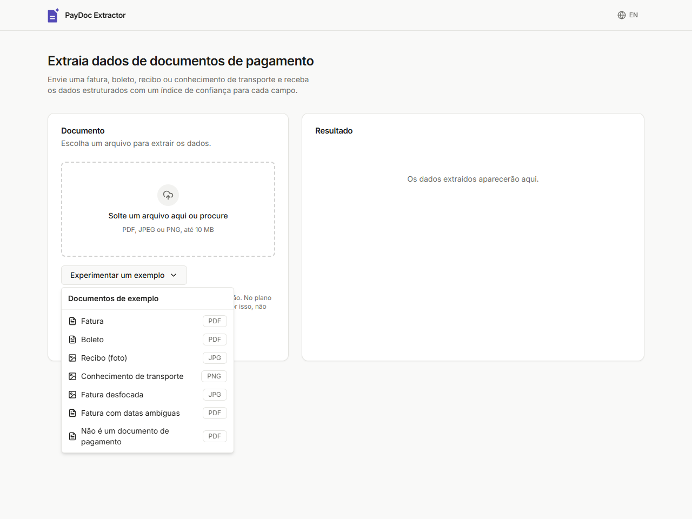<br /><sub>Experimentar um exemplo: sete documentos sintéticos incluídos</sub></td>
    <td align="center">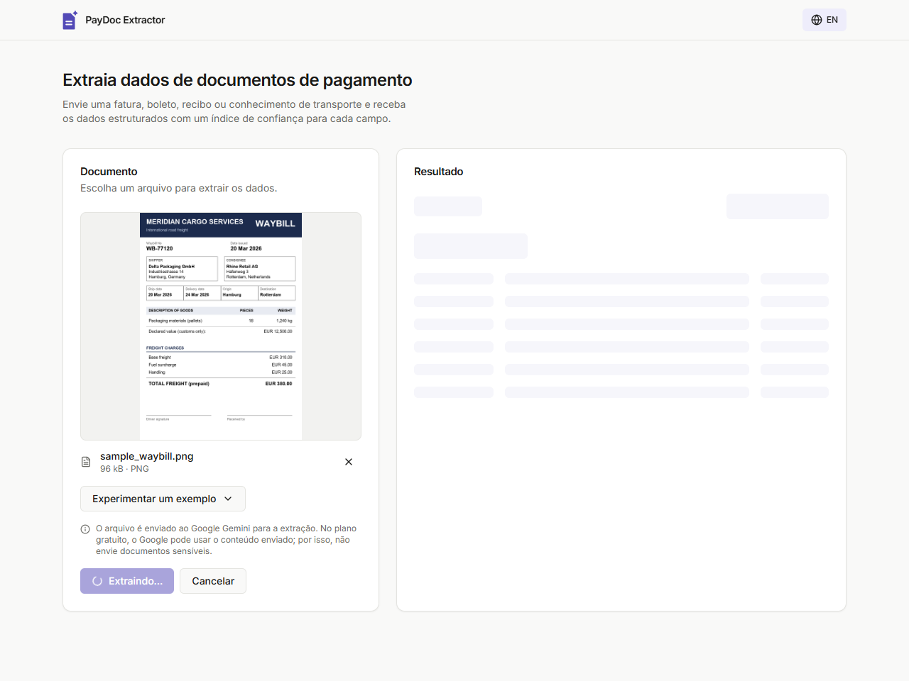<br /><sub>Extração em andamento, com Cancelar</sub></td>
  </tr>
  <tr>
    <td align="center">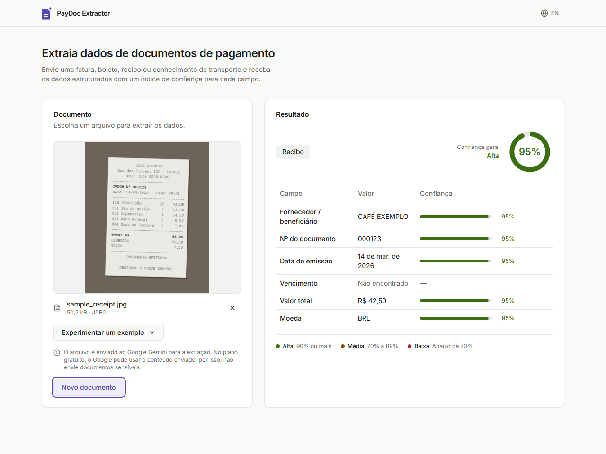<br /><sub>Um campo que o documento não tem aparece como Não encontrado</sub></td>
    <td align="center">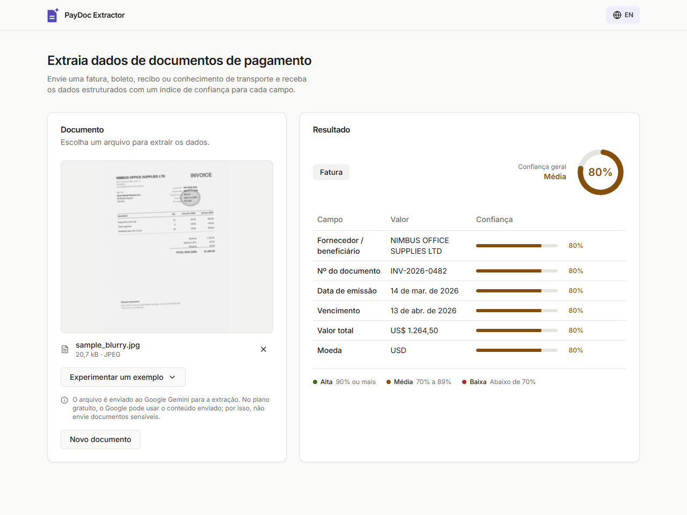<br /><sub>Uma digitalização ruim reduz a confiança (o total foi lido errado aqui, veja Limitações)</sub></td>
  </tr>
  <tr>
    <td align="center">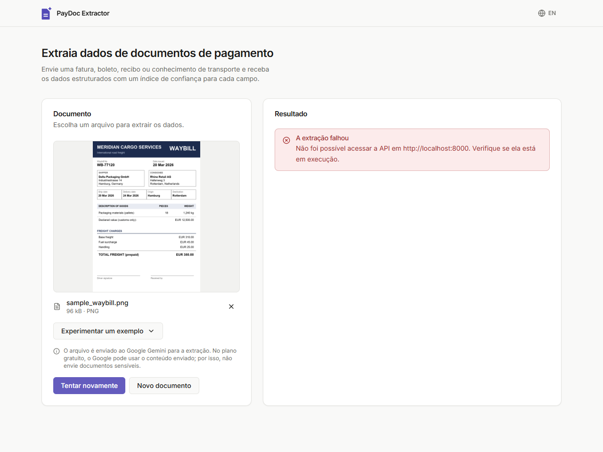<br /><sub>Erro claro, com nova tentativa, quando a API está inacessível</sub></td>
    <td align="center">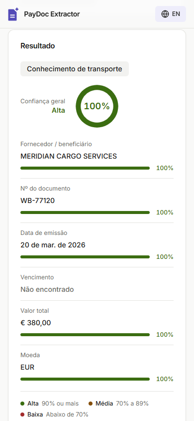<br /><sub>Layout no celular</sub></td>
  </tr>
</table>

### Funcionalidades

- **Classificação do documento**, fatura, boleto, recibo, conhecimento de transporte ou desconhecido para qualquer outro
- **Seis campos estruturados**, fornecedor, número do documento, data de emissão, vencimento, valor total e moeda, com datas em ISO 8601 e valores como números simples
- **Confiança por campo**, mais uma pontuação geral exibida em um medidor e em um nível Alta / Média / Baixa
- **Lacunas honestas**, um campo que não está no documento volta como `null` e aparece como "Não encontrado", em vez de um palpite
- **Marcação para revisão**, campos abaixo de um limite configurável são listados na resposta e sinalizados na interface
- **Envie um arquivo ou experimente um exemplo**, arraste um PDF, JPEG ou PNG de até 10 MB, ou carregue um dos exemplos incluídos e clique em Extrair
- **Cancelar e tentar de novo**, uma extração em andamento pode ser cancelada, e uma que falhou pode ser repetida
- **Interface em Inglês / Português**, trocável em tempo real, com datas e valores formatados para o idioma escolhido
- **Aviso de privacidade**, sempre visível, já que o arquivo é enviado ao Google Gemini

### Stack técnica

| Camada | Tecnologia |
|---|---|
| API | FastAPI, Pydantic, pydantic-settings, Uvicorn |
| IA | Google Gemini pelo SDK `google-genai` (assíncrono, saída estruturada) |
| Frontend | React 19, TypeScript, Vite |
| Estilização | Tailwind CSS, primitivos Radix UI no estilo shadcn/ui, `class-variance-authority` |
| Gráficos | Recharts (o medidor de confiança, carregado sob demanda) |

### Como funciona

1. O navegador envia o arquivo para `POST /extract` como multipart form data.
2. A API verifica o tipo (PDF, JPEG, PNG), se o arquivo não está vazio e o limite de tamanho.
3. Os bytes vão para o Gemini como uma parte inline, junto com um system prompt. A resposta precisa seguir o schema `ExtractionResult`.
4. A API valida a resposta e calcula `overall_confidence` e `low_confidence_fields` por conta própria.
5. O navegador mostra o tipo, os campos, as pontuações por campo e as marcações de revisão.

Exemplo de resposta para a fatura incluída:

```json
{
  "document_type": "invoice",
  "data": {
    "vendor_name": "NIMBUS OFFICE SUPPLIES LTD",
    "document_number": "INV-2026-0482",
    "issue_date": "2026-03-14",
    "due_date": "2026-04-13",
    "total_amount": 1284.5,
    "currency": "USD"
  },
  "confidence": {
    "vendor_name": 1.0,
    "document_number": 1.0,
    "issue_date": 1.0,
    "due_date": 1.0,
    "total_amount": 1.0,
    "currency": 1.0
  },
  "overall_confidence": 1.0,
  "low_confidence_fields": []
}
```

| Endpoint | Descrição |
|---|---|
| `GET /health` | Retorna `{"status": "ok"}` |
| `POST /extract` | Campo multipart `file`. Retorna o JSON acima |

| Status | Quando |
|---|---|
| `400` | Nenhum arquivo foi enviado, ou o arquivo está vazio |
| `413` | O arquivo é maior que `MAX_UPLOAD_MB` |
| `415` | O arquivo não é PDF, JPEG ou PNG |
| `502` | A chamada ao Gemini falhou ou devolveu algo inutilizável |

A documentação interativa da API fica em `/docs` enquanto ela estiver rodando.

### Destaques de engenharia

Alguns pontos que vale a pena olhar mais de perto no código:

- **Um schema para o modelo e para a API**, o modelo Pydantic `ExtractionResult` ([`app/schemas.py`](app/schemas.py)) é também o `response_schema` do Gemini, então as descrições dos campos fazem parte do prompt. A resposta é validada de novo no servidor, e o que não bater com o schema vira um `502` em vez de dado ruim.
- **A confiança é calculada pela aplicação**, `overall_confidence` e `low_confidence_fields` vêm de uma pequena função pura ([`app/extraction_service.py`](app/extraction_service.py)), nunca do modelo. Campos `null` ficam de fora, então um campo ausente nem puxa a média para baixo nem é sinalizado.
- **Um prompt escrito contra erros confiantes**, [`app/prompts.py`](app/prompts.py) instrui o modelo a preferir `null` a um palpite, a deixar vazias as datas ambíguas em vez de supor dia/mês ou mês/dia, a avaliar a qualidade de leitura e a conferir os itens com o total. Os [exemplos sintéticos](samples) trazem armadilhas (um número de pedido ao lado do número da fatura, um subtotal acima do total, dígitos parecidos) para testar exatamente isso.
- **Configuração que falha cedo**, as configurações são validadas na inicialização ([`app/config.py`](app/config.py)): uma chave de API ausente ou uma origem CORS malformada interrompe o processo com uma mensagem que cita a variável.
- **Nada é persistido**, o upload vai direto para o modelo como bytes. Não há banco de dados nem armazenamento de arquivos, e a interface guarda no `localStorage` apenas o idioma escolhido.
- **Contrato tipado dos dois lados**, [`frontend/src/types.ts`](frontend/src/types.ts) espelha os schemas da API, e as traduções ([`frontend/src/lib/i18n.ts`](frontend/src/lib/i18n.ts)) são tipadas, de modo que uma chave ausente em um idioma falha no `tsc`.
- **Uma máquina de estados de extração de verdade**, um reducer em [`useExtraction`](frontend/src/hooks/useExtraction.ts) conduz ocioso, pronto, extraindo, sucesso e erro, incluindo cancelamento via `AbortController`, controle de foco do teclado e anúncios `aria-live`.
- **A confiança nunca depende só de cor**, cada nível tem nome e legenda, e as cores dos tokens foram verificadas quanto ao contraste WCAG AA.
- **Especificações primeiro**, [`specs/`](specs) reúne os requisitos em formato EARS, o design com rastreabilidade até eles e as listas de tarefas da API e da interface.

### Estrutura do projeto

```
app/                       # Backend FastAPI
├── main.py                # Rotas, validação de entrada, mapeamento de erros, CORS
├── config.py              # Configurações do ambiente, validadas na inicialização
├── schemas.py             # Modelos Pydantic, também o schema de resposta do Gemini
├── prompts.py             # System prompt e regras de extração
├── gemini_client.py       # Chamada assíncrona ao Gemini e tratamento de erros
└── extraction_service.py  # Orquestração e agregação da confiança
frontend/src/
├── components/            # Upload, prévia, resultado, medidor, tabela, cabeçalho
│   └── ui/                # Primitivos baseados em Radix (estilo shadcn/ui)
├── contexts/              # Provider de idioma
├── hooks/                 # Máquina de estados useExtraction
├── lib/                   # Cliente da API, i18n, formatação, validação de arquivo, exemplos
├── types.ts               # Tipos que espelham os schemas da API
├── App.tsx
└── main.tsx
samples/                   # Documentos sintéticos com os valores esperados
specs/                     # Requisitos, design e tarefas
docs/screenshots/          # Imagens usadas neste README
```

### Limitações

- **Privacidade no plano gratuito.** No plano gratuito do Gemini, o Google pode usar o conteúdo enviado para melhorar seus produtos. Não envie documentos reais ou sensíveis com uma chave gratuita. Os exemplos incluídos são inventados.
- **A confiança é uma estimativa do próprio modelo**, não uma probabilidade calibrada. Na fatura desfocada incluída, o modelo costuma ler o total como 1.264,50 em vez de 1.284,50 e informa de 80% a 95% para os campos, o que está acima do limite de revisão de 70%, então nada é sinalizado. Use a pontuação como um convite para conferir, e verifique os valores que importam.
- **Escopo fixo.** Um documento por requisição, seis campos fixos, sem itens de linha, e PDF, JPEG ou PNG de até 10 MB (configurável).
- **Sem autenticação e sem armazenamento.** A API não tem autenticação, então não a exponha publicamente como está. Ela foi pensada para rodar localmente.
- **A prévia de PDF** usa o visualizador embutido do navegador, então o enquadramento da página depende do navegador.

### Roadmap

- Comparar os valores extraídos com os esperados quando um exemplo incluído for usado
- Destacar cada campo na imagem do documento
- Histórico opcional das extrações anteriores
- Autenticação e uma implantação hospedada

---

### Como rodar o projeto

**Pré-requisitos**

- [Python](https://www.python.org/) 3.10+
- [Node.js](https://nodejs.org/) 20.19+
- Uma [chave de API do Gemini](https://aistudio.google.com/apikey) gratuita

**1. Clone o repositório**

```bash
git clone https://github.com/italoglhrm/gemini-paydoc-extractor.git
cd gemini-paydoc-extractor
```

**2. Configure a chave de API**

Copie `.env.example` para `.env` na raiz do projeto e informe a sua chave:

```env
GEMINI_API_KEY=sua-chave-de-api
```

> O arquivo `.env` está no `.gitignore` e nunca será enviado ao repositório.

Configurações opcionais, com os valores padrão:

| Variável | Padrão | Descrição |
|---|---|---|
| `GEMINI_API_KEY` | nenhum, obrigatória | Sua chave de API do Gemini |
| `GEMINI_MODEL` | `gemini-3.5-flash-lite` | Modelo usado na extração |
| `MAX_UPLOAD_MB` | `10` | Maior arquivo aceito |
| `LOW_CONFIDENCE_THRESHOLD` | `0.7` | Campos abaixo deste valor são sinalizados para revisão |
| `CORS_ORIGINS` | `http://localhost:5173` | Origens de navegador autorizadas a chamar a API, separadas por vírgula |

**3. Rode a API**

```bash
python -m venv .venv
```

Ative o ambiente: `source .venv/bin/activate` no macOS e Linux, ou `.venv\Scripts\Activate.ps1` no PowerShell do Windows. Depois:

```bash
pip install -r requirements.txt
uvicorn app.main:app --reload --port 8000
```

A API estará disponível em `http://localhost:8000`. Abra `http://localhost:8000/health` para conferir, e `http://localhost:8000/docs` para a documentação interativa. Se a chave estiver ausente, ela para na inicialização e avisa.

**4. Rode a interface**

Em um segundo terminal:

```bash
cd frontend
npm install
npm run dev
```

O app estará disponível em `http://localhost:5173`. Se a API rodar em outro endereço, copie `frontend/.env.example` para `frontend/.env`, defina `VITE_API_URL` e adicione a origem da interface em `CORS_ORIGINS` na API.

**5. Experimente**

Clique em **Experimentar um exemplo**, escolha um documento e clique em **Extrair**. Ou chame a API diretamente:

```bash
curl -F "file=@samples/sample_invoice.pdf" http://localhost:8000/extract
```

A pasta [`samples/`](samples) lista os valores esperados de cada documento.

---

## License

MIT, see [LICENSE](LICENSE).

---

<div align="center">

Built by [@italoglhrm](https://github.com/italoglhrm)

</div>
